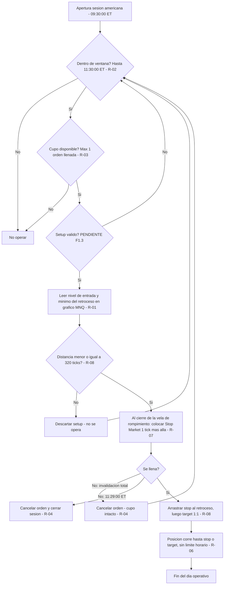
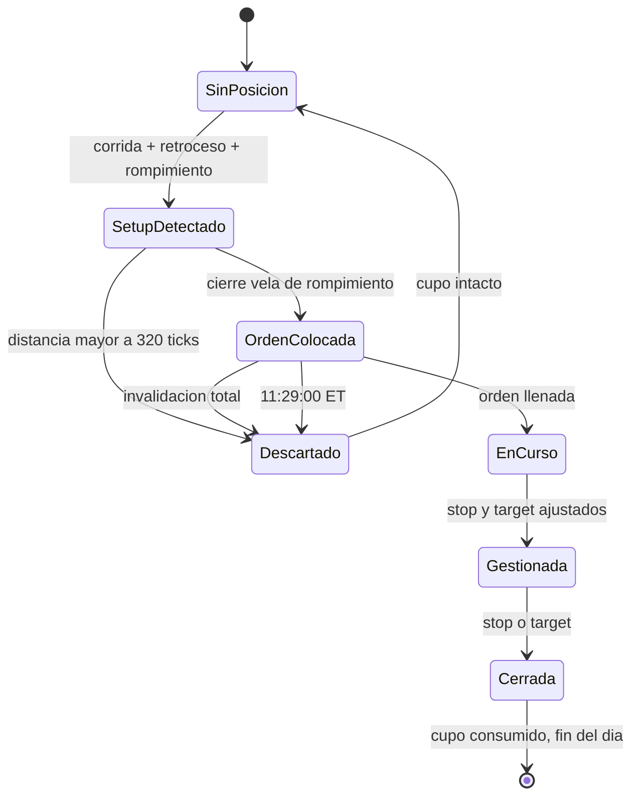

# TRADING PLAN — Estrategia Chaumer (NQ / MNQ · NinjaTrader 8)

**Versión:** 2.1 — 🏁 **FASE 1 CERRADA**
**Última actualización:** 2026-09-01
**Operador:** Christian
**Metodología base:** Alfredo Chaumer (*trader_sociologist*)
**Uso:** personal

---

## Estado de construcción

| Sub-fase | Contenido | Estado |
|---|---|---|
| **F1.0** | Perímetro y contexto operativo | ✅ **Cerrada** — R-01 a R-09 confirmadas |
| **F1.1** | Glosario y definiciones operativas | ✅ **CERRADA** — R-10 a R-21 · 22 términos definidos · 8 descartados · 4 movidos a contextualización |
| **F1.2** | Lectura de contexto y sesgo direccional | ✅ **CERRADA SIN REGLAS** — ver nota |
| **F1.3** | Identificación del setup | ✅ **CERRADA** — `R-22` IRI y `R-23` Reingreso confirmadas |
| **F1.4** | Gatillo de entrada | ✅ **CERRADA SIN REGLAS NUEVAS** — ya cubierta por `R-07`, `R-13`, `R-22`, `R-23`, `R-04` |
| **F1.5** | Stop loss y objetivos | ✅ **CERRADA** — `R-24` + `R-08` corregida + `PARAMETROS.md` |
| **F1.12** | Estructura y marcado | ✅ **CERRADA** — `R-34` a `R-39` · `R-04`, `R-13`, `R-14`, `R-17`, `R-18`, `R-23`, `R-24` corregidas |
| **F1.6** | Gestión de la posición | ✅ **CERRADA** — `R-25`: no se gestiona, nunca |
| **F1.7** | Riesgo y tamaño de posición | 🟠 **CERRADA CON HUECO DECLARADO** — `R-26` · sin regla de parada (`P-21`) |
| **F1.8** | Filtros y prohibiciones | ✅ **CERRADA** — `R-27` FOMC · `R-28` estado del operador |
| **F1.9** | Proceso operativo diario | ✅ **CERRADA** — `R-29` + `CHECKLIST_DIARIA.md` |
| **F1.10** | Galería de casos | ✅ **CERRADA** — 21 casos, incluidos descartes, días sin operar, órdenes canceladas y 11 sesiones completas al tick |
| **F1.11** | Test de operabilidad | 🚨 **NO EJECUTADA — HUECO DECLARADO.** La fase se cierra sin el test ciego, por decisión del operador. Ver `CIERRE_FASE_1.md` y `P-29` |

**Archivos del plan:**

- `CLAUDE.md` (raíz) — **instrucciones para Claude Code en la fase 2**
- `01_Plan\CIERRE_FASE_1.md` — **acta de cierre de la fase 1: qué está probado y qué no**
- `04_Web\BRIEF_PORTAL.md` — qué tiene que resolver el portal y qué no puede hacer
- `01_Plan\ESTADO.md` — **índice compacto. Punto de arranque de cada sesión**
- `01_Plan\PARAMETROS.md` — **los números que pueden cambiar, en un solo sitio**
- `01_Plan\CHECKLIST_DIARIA.md` — **la secuencia del día, para ejecutar sin decidir**
- `01_Plan\GALERIA.md` — casos reales etiquetados · imágenes en `02_Assets\galeria\`
- `01_Plan\TRADING_PLAN_CHAUMER.md` — este documento
- `01_Plan\reglas.json` — espejo estructurado de las reglas
- `01_Plan\GLOSARIO.md` — términos con definición medible
- `01_Plan\PENDIENTES.md` — reglas sin cerrar y decisiones aplazadas
- `01_Plan\CONTEXTUALIZACION.md` — **elementos que NO son reglas** y no deben serlo
- `01_Plan\subfases\F1.0_Perimetro.md` — bloque completo de F1.0 con notas de auditoría
- `01_Plan\subfases\F1.1_Glosario.md` — bloque de F1.1
- `03_Materia_Prima\registro_sobreextension.csv` — trabajo de campo abierto para cerrar `P-11`

---

## 🚨 ADVERTENCIA DE USO — LEER ANTES DE CONSTRUIR NADA SOBRE ESTE PLAN

**Las 12 sub-fases están cerradas: 39 reglas.** El plan está **completo en reglas y contrastado contra 11 sesiones reales al tick**, corregido vela a vela por el operador.

**Pero NO está probado.** El test ciego de `F1.11` —el único que demuestra que un tercero con este documento en la mano llega a las mismas decisiones que el operador— **no se ha ejecutado**. La fase 1 se cierra sin él, por decisión explícita del operador el 01/09/2026.

Lo que eso significa, dicho sin adornos:

| | |
|---|---|
| ✅ **Sí está demostrado** | que las reglas escritas reproducen el marcado del operador en 11 sesiones, y que el motor de auditoría llega a sus mismas entradas, stops y objetivos |
| ❌ **NO está demostrado** | que otra persona, leyendo solo este documento, llegue a lo mismo. Eso es exactamente lo que mide el test ciego |
| ❌ **NO está escrito** | la regla de parada — cuándo se deja de operar en la semana o el mes (`P-21`) |
| ❌ **NO está en el plan** | la capa de contextualización, que es la que decide varios de los días de "hoy no opero" (ver `CONTEXTUALIZACION.md`) |

> 🔴 **Cualquier producto construido sobre este plan —portal web incluido— debe mostrar estos cuatro puntos, no esconderlos.** Un plan mecánico sin test ciego es un plan escrito, no un plan probado.

Detalle completo del cierre y de lo que quedó fuera: **`CIERRE_FASE_1.md`**.

---

## ⬜ F1.2 · Cerrada sin reglas — por qué

**El operador no tiene ninguna regla que decida si opera o no antes de ver un setup** (24/08/2026).

Dos motivos, y los dos son estructurales:

1. **No hay sesgo direccional.** Por `R-05` se opera el **primer setup válido**, largo o corto. La dirección la da el rompimiento, no una lectura previa.
2. **Todo lo que F1.2 habría capturado ya está en `CONTEXTUALIZACION.md`.** Sobreextensión, lateralización, volumen en sesión, alejamiento de la zona, fluidez, longitud del recorrido y tamaño de estructura — los siete salieron a esa capa porque el propio operador dijo que no tienen número.

> ⚠️ **Lo que esto implica.** La decisión de *"hoy no opero"* existe y pesa —en las 4 sesiones grabadas Chaumer no operó 2 días por contexto— pero **queda fuera del plan mecánico, a propósito**. El test ciego de `F1.11` no podrá validarla.

---

# F1.3 · Identificación del setup ✅

## Taxonomía — cerrada 24/08/2026

**Fuente:** el selector de setups del propio NinjaTrader del operador (captura en `02_Assets\`).

| Familia | Variante | Dirección | Mecánica |
|---|---|---|---|
| **IRI** *(Impulso–Retroceso–Impulso)* | **Apertura** | alcista / bajista | 🔗 **idéntica a Continuación** |
| **IRI** | **Continuación** | alcista / bajista | 🔗 **idéntica a Apertura** |
| **Reingreso** | — | alcista / bajista | distinta |

**6 entradas en el menú → 2 mecánicas distintas.** El espejo alcista/bajista no se documenta por separado: `R-10`, `R-11` y `R-12` ya establecen que todo se refleja exacto.

### `IRI Apertura` vs `IRI Continuación` — no es una distinción operativa

> *"Son la misma mecánica, solo que IRI Apertura se da cuando es la apertura, y el otro IRI ya se da durante la jornada operativa."* — Operador, 24/08/2026

**El plan escribe UNA sola regla de IRI.** La etiqueta Apertura/Continuación existe solo para el **registro estadístico**, no cambia ninguna condición de entrada, stop o target.

> 📌 **`P-20` (menor).** Dónde termina "la apertura" y empieza "la jornada" no tiene número. **No bloquea nada operativo** — solo afecta a cómo se clasifica una operación ya ejecutada. Se cerrará en `F1.9` (proceso diario) o `F1.10`.

---

## R-22 · Setup IRI *(Impulso–Retroceso–Impulso)*

- **Categoría:** setup
- **Enunciado:** Corrida, retroceso, zona, rompimiento de esa zona y consecución. La consecución es la entrada.
- **Condición medible:**

| # | Paso | Regla |
|---|---|---|
| 1 | **Corrida** | `R-10` |
| 2 | **Retroceso** | `R-11` |
| 3 | Se marca la **zona** en la vela extrema de la corrida. Alcista → RESISTENCIA · Bajista → SOPORTE | `R-12` |
| 4 | **Rompimiento** de esa zona por **≥1 tick**, en el sentido de la corrida | `R-13` |
| 5 | **Consecución** ≥1 tick más allá del extremo de la vela de rompimiento ← **ENTRADA** | `R-13` + `R-07` |

- **Plazo:** **5 velas** desde la siguiente a la de rompimiento. Lo habitual es la 1ª o la 2ª (`C-09`).
- **Zona requerida:** **sí** — y la genera el propio impulso del paso 1. **No existe IRI sin zona.**
- **Filtro de target:** solo **zona vigente** (`R-14`). El punto de referencia **no** aplica al IRI.
- **Acción:** Stop Market al cierre de la vela de rompimiento, en el nivel de consecución (`R-07`). Bajista: espejo exacto.
- **Excepciones:** si a la 6ª vela no hubo consecución, la **entrada** queda invalidada. El destino de la **zona** lo deciden `R-15`/`R-16`.
- **Estado:** ✅ Confirmada 24/08/2026

> 🔑 **El IRI es autocontenido:** el propio setup crea la zona que después rompe.

---

## R-23 · Setup Reingreso

- **Categoría:** setup
- **Enunciado:** Tras un rompimiento con consecución que falla, el precio recupera la zona entera y se opera en sentido contrario.
- **Condición medible:**

| # | Paso |
|---|---|
| 1 | Sobre una zona hay **rompimiento + consecución** (`R-13`) |
| 2 | 🔴 **La consecución falla EN EL ACTO** — ver el plazo, abajo |
| 3 | El precio **atraviesa la zona entera y SOBREPASA el borde contrario** → **vela de reingreso**. Alcista: supera el **borde superior** del soporte. Bajista: supera el **borde inferior** de la resistencia. **No basta con tocar la zona.** Esta vela hace de vela de rompimiento |
| 4 | **Consecución** ≥1 tick más allá de la vela de reingreso ← **ENTRADA** |
| 5 | 🔴 El **target debe caber dentro del punto de referencia** |

- **🔴 PLAZO — EL REINGRESO ES INMEDIATO O NO ES.** *(añadido 27/08/2026)* La ventana de reingreso se abre con la vela de consecución y **se cierra en cuanto el precio supera el extremo de esa vela de consecución**. Si el precio sigue de largo en el sentido del rompimiento, aunque sea un tick, **el rompimiento quedó bueno y ya no hay reingreso posible sobre esa zona** — por mucho que el precio vuelva a pasar por ella más tarde.
  - **Caso que SÍ es reingreso — 6/07/2026:** zona `R` 29.926,50–29.939,25. Rompe la vela 8:46; la 8:47 da la consecución subiendo a 29.967,25 y **esa misma vela** se desploma a 29.908,75, otra vez bajo la zona. → reingreso válido (`G-12`).
  - **Caso que NO lo es — 13/07/2026:** zona `R` 29.652,25–29.666,75. Rompe la vela 9:25 (máx 29.677,25), consecución la vela 9:27 (máx 29.681,00) y el precio **sigue subiendo** hasta 29.724,00. Lo que hace la vela 9:41, catorce velas después, **no es un reingreso**.
- **🔑 La misma vela puede cerrar el rompimiento fallido y abrir el reingreso.** Si la vela que da la **consecución** del rompimiento se da la vuelta dentro del mismo minuto, atraviesa la zona entera y sale por el borde contrario, **esa misma vela es a la vez consecución y vela de reingreso**. **No se exige una vela posterior.** Confirmado 26/08/2026 sobre caso real: la vela de las **8:47 del 06/07/2026** (`G-12`).
- **Dirección:** contraria al rompimiento fallido.
- **Filtro propio — punto de referencia:** el **extremo del retroceso que originó la zona**. Reingreso alcista → el target debe quedar **por debajo** de ese máximo; bajista → **por encima** de ese mínimo. Si no cabe, **el reingreso es inválido y no se opera**.
- **Acción:** Stop Market al cierre de la vela de reingreso, en el nivel de consecución. **Verificar el punto de referencia antes de enviar.**
- **Estado:** ✅ Confirmada 24/08/2026 · **plazo añadido 27/08/2026**
- **Diagrama:** `02_Assets\diagramas\R-23_reingreso.png`

> 🔑 **Es la contraria del IRI:** el IRI opera el rompimiento que **funciona**; el Reingreso, el que **falló**.

---

# F1.5 · Stop y objetivos ✅

## R-24 · Stop y target

- **Categoría:** gestión
- **Enunciado:** Ancla la regla en el nivel de entrada, mide el stop hasta su referencia estructural y pon el target a esa misma distancia.
- **Condición medible:**

| Paso | |
|---|---|
| **1** | La regla se ancla en el **nivel de entrada** (la consecución) |
| **2** | Se mide el stop hasta su referencia estructural |
| **3** | El target recorre **esa misma distancia** al otro lado — `RATIO_TARGET` = **1:1** |

### Dónde va el stop — **corregido 27/08/2026**

| Setup | Largo | Corto |
|---|---|---|
| **IRI** | punto **más bajo alcanzado desde que nació la zona hasta el rompimiento** | punto **más alto alcanzado desde que nació la zona hasta el rompimiento** |
| **Reingreso** | punto **más bajo de la corrida fallida** | punto **más alto de la corrida fallida** |

> 🔴 **No es solo el extremo del retroceso que originó la zona.** Cuenta **todo** lo que el precio haya hecho mientras la zona estuvo viva, hasta la vela de rompimiento. Si la zona aguanta muchas velas y el precio se aleja más que en su retroceso original, el stop se va con él.
> **Caso real 7/07/2026:** el soporte de la vela 9:27 se rompe con la vela 9:36. El retroceso que lo originó (9:28–9:30) tenía su techo en 29.313,00 — ese era el stop con la redacción vieja. Pero la vela 9:32 subió hasta **29.327,75**. Con la regla correcta el riesgo pasa de 71,50 a **86,25 pts** y **la entrada queda descartada por `STOP_MAX`**.

> **Geometría:** el stop del Reingreso mide contra la corrida que rompió la zona y falló — al **otro lado** de la zona. Incluye el ancho de la zona entera, así que **tiende a ser mayor** que el de un IRI. El filtro `STOP_MAX` muerde más en Reingreso.

### Los tres filtros que pueden anular la operación

| # | Comprobación | Aplica a |
|---|---|---|
| 1 | stop estructural ≤ **`STOP_MAX`** (80 pts) | ambos |
| 2 | el target 1:1 **libre de zonas vigentes** (`R-14`) | ambos |
| 3 | el target 1:1 cabe dentro del **punto de referencia** (`R-23`) | solo Reingreso |

- **Acción:** si **cualquiera** de los tres falla, **la entrada queda invalidada y no se opera**.

> 🔴 **El target NUNCA se acorta para que quepa.** Palabras del operador: *"siempre el target debe estar libre de zonas o debe siempre tener espacio de recorrido sin nada en contra"*. No existe media entrada ni ratio reducido.

- **Estado:** ✅ Confirmada 24/08/2026

---

# F1.9 · Proceso operativo diario ✅

## R-29 · Checklist diaria y registro

- **Categoría:** proceso
- **Enunciado:** Ejecuta la sesión siguiendo la checklist diaria **en orden**, y registra **todas** las sesiones, incluidas aquellas en que no se operó.
- **Documento:** `01_Plan\CHECKLIST_DIARIA.md`

| Bloque | Cuándo | Contiene |
|---|---|---|
| **A** | **antes de abrir NT8** | `R-28` estado · `R-27` FOMC · `R-21` noticias |
| **B** | premercado, desde 19:00 Col | `R-09` · `R-20` · `R-12` · `R-17` · `R-18` |
| **C** | ventana operativa | `R-05` · `R-22`/`R-23` · `R-24` filtros · `R-07` envío · `R-04` cancelación |
| **D** | tras el llenado | `R-08` ajuste · `R-25` no tocar · `R-03` cupo |

- **Registro automático** (indicador NT8): entrada · salida · niveles · hora · resultado.
- **Registro manual:** setup · imagen · errores · observaciones · **y el motivo los días en que no se operó**.
- **Estado:** ✅ Confirmada 24/08/2026

> 🔑 **`R-29` no añade criterio operativo.** Ordena las 28 reglas anteriores en la secuencia real del día, para que la sesión se ejecute leyendo de arriba abajo sin decidir nada.

> 🔑 **El bloque A se contesta antes de abrir la plataforma.** Con el gráfico delante, `R-28` ya no es la misma pregunta.

> 📓 **Lo que hace valioso este journal es que registra los días SIN operar y el porqué.** Casi ninguno lo hace, y es exactamente el dato que necesitan `P-01`, `P-20`, `P-21` y `D-09`. Sin él, esos cuatro pendientes no se cierran nunca.

---

# F1.8 · Filtros y prohibiciones ✅

## R-27 · Día de FOMC

- **Categoría:** filtro
- **Enunciado:** En día de FOMC **no se opera IRI. Solo se permite Reingreso.**

| | |
|---|---|
| **Qué es un día de FOMC** | cualquier día en que **Forex Factory** marque en **rojo** un evento de la Fed — decisión de tipos, actas o discursos de Powell |
| **Fuente** | Forex Factory, **la misma única fuente de `R-21`** |
| **Alcance** | el **día entero**, no solo la hora del anuncio |
| **IRI** (`R-22`) | ❌ **prohibido** |
| **Reingreso** (`R-23`) | ✅ **permitido**, con todas sus condiciones normales |

- **Acción:** ese día solo se busca Reingreso. **Un IRI válido se deja pasar aunque cumpla todo.**
- **Estado:** ✅ Confirmada 24/08/2026

> 🔑 **Convive con `R-21` sin conflicto.** Un evento rojo de la Fed dispara las dos: el veto de IRI durante todo el día **y** el bloqueo de ±5 minutos. Misma fuente única, así que no hay dos calendarios que puedan discrepar.
>
> **La lógica del filtro:** el operador descarta el setup que **persigue continuación** y conserva el que **opera rompimientos fallidos** — justo el comportamiento que domina un mercado a la espera de la Fed.

---

## R-28 · Estado del operador

- **Categoría:** filtro
- **Enunciado:** **No se opera estando enfermo o sin encontrarse bien mentalmente.**
- **Criterio:** **libre.** Juicio del operador, sin condición medible. Decisión consciente del 24/08/2026.
- **Acción:** no abrir operativa ese día.
- **Estado:** ✅ Confirmada 24/08/2026

> ⚠️ **Es la única regla del plan sin criterio medible**, y la única que **un tercero no puede verificar**. Queda **fuera del alcance del test ciego de `F1.11`**: ninguna captura podrá decir si se aplicó bien o mal.
>
> El operador la mantiene como criterio libre a propósito, y está registrado que lo es — no es un olvido ni un `PENDIENTE` disfrazado.

---

# F1.7 · Riesgo y tamaño de posición 🟠

## R-26 · Tamaño de posición

- **Categoría:** riesgo
- **Enunciado:** Opera siempre **1 contrato MNQ**. El tamaño no cambia por capital, racha ni convicción.
- **Condición medible:** `CONTRATOS` = **1**. No sube aunque la cuenta crezca; no baja aunque la cuenta caiga.
- **Revisión:** **anual**. Es el único momento en que se evalúa cambiar el número de contratos.
- **Estado:** ✅ Confirmada 24/08/2026

## 🚨 El hueco declarado de esta sub-fase

**El plan no tiene ninguna regla de parada.** El operador lo confirma el 24/08/2026 y decide dejarlo abierto a propósito, para decidirlo con datos reales.

| Días malos seguidos | Capital restante | Caída | Para recuperar |
|---|---|---|---|
| 4 | $2.360 | −21 % | +27 % |
| 6 | $2.040 | −32 % | +47 % |
| 10 | $1.400 | **−53 %** | **+114 %** |
| 15 | $600 | −80 % | +400 % |

> ⚠️ **Ninguna regla del plan se rompe en esa tabla.** Cada uno de esos días fue un setup válido, con su stop correcto, ejecutado exactamente como está escrito. **El plan permite ese recorrido sin emitir una sola señal de alarma.**
>
> Y con `R-26` (tamaño fijo) más `STOP_MAX` fijo, **el riesgo porcentual crece solo cuando peor vas**: con $1.400 restantes, $160 ya no son el 5 % sino el 11 %.

**Detalle completo, frecuencia esperada y moldes posibles: `P-21` en `PENDIENTES.md`.**

---

# F1.6 · Gestión de la posición ✅

## R-25 · No se gestiona

- **Categoría:** gestión
- **Enunciado:** Una vez ajustados stop y target, **no se gestiona la posición. Nunca.**

> *"Después de una entrada, y después de ajustar stop y target a sus respectivos niveles, no se toca nada, jamás. Se deja que el mercado haga lo suyo y defina su respectivo resultado. Repito, jamás se gestiona."*
> — Operador, 24/08/2026

### Lo que queda prohibido, sin excepción

| | |
|---|---|
| Mover el **stop** | ❌ en cualquier dirección |
| Mover el **target** | ❌ en cualquier dirección |
| **Breakeven** manual | ❌ |
| **Cerrar a mano** | ❌ también si el precio no se mueve o va en contra |
| **Cierre parcial** | ❌ `R-08` fija 1 contrato: no hay nada que partir |
| **Añadir** contratos | ❌ |
| **Cerrar por hora** | ❌ no existe · `R-06` |

**Solo hay dos salidas: stop o target.** No hay una tercera.

- **Excepciones:** **ninguna.**
- **Estado:** ✅ Confirmada 24/08/2026

> 🔑 **Es la única regla del plan enunciada como prohibición absoluta.** Y tiene un efecto que va más allá de la disciplina: convierte cada operación en un **experimento limpio**. Cuando en `F1.10` se midan los resultados, medirán el setup — no la gestión. Sin esta regla, un plan mecánico no sería medible.

---

# F1.4 · Gatillo de entrada ✅ — cerrada sin reglas nuevas

El gatillo ya estaba escrito repartido entre reglas anteriores. El operador confirmó el 24/08/2026 que **no hay ningún paso adicional** entre ver el setup y enviar la orden.

| Qué pide F1.4 | Dónde está |
|---|---|
| Tipo de orden | `R-07` — Stop Market |
| Nivel exacto | `R-07` — 1 tick más allá de la vela de rompimiento o de reingreso |
| Momento de colocación | `R-07` — al cierre de esa vela |
| Qué dispara la entrada | `R-13`, `R-22`, `R-23` — la consecución |
| Verificación previa | `R-08`, `R-24` — los tres filtros |
| Cuándo se cancela | `R-04` |

---

## Los dos setups, uno al lado del otro

| | **IRI** | **Reingreso** |
|---|---|---|
| **Qué opera** | el rompimiento que **funciona** | el rompimiento que **falló** |
| **Dirección** | a favor del rompimiento | **contraria** |
| **Plazo de consecución** | **5 velas** | **ninguno** |
| **Filtro de target** | zona vigente | zona vigente **+ punto de referencia** |
| **Origen de la zona** | la crea el propio setup | preexistente |

---

# F1.0 · Perímetro y contexto operativo ✅

*Bloque completo con notas de auditoría y reglas heredadas sin auditar: `subfases\F1.0_Perimetro.md`*

## R-01 · Instrumento, gráficos y timeframe

- **Categoría:** contexto
- **Enunciado:** Analiza y marca zonas sobre NQ; lee el trigger, el stop y el target sobre MNQ; ejecuta exclusivamente en MNQ.
- **Condición medible:** Análisis: **NQ** ($20,00/pt · tick 0,25 pts = $5,00). Ejecución: **MNQ** ($2,00/pt · tick 0,25 pts = $0,50). Timeframe único: **velas japonesas de 1 minuto**. Desfase observado NQ↔MNQ: 0–3 ticks.
- **Cómo se verifica en NT8:** dos gráficos de 1 min abiertos. Gráfico NQ → zonas, volumen, contexto. Gráfico MNQ → precio de trigger/stop/target y envío de orden. Ningún análisis en MNQ; ninguna orden desde NQ.
- **Acción:** el nivel **no se traduce** desde NQ. Se lee el máximo (long) o mínimo (short) real de la vela en el gráfico de **MNQ** y se le aplica el desplazamiento de 1 tick. Stop y target también se leen sobre MNQ.
- **Excepciones:** ninguna
- **Estado:** ✅ Confirmada

## R-02 · Ventana operativa

- **Categoría:** contexto
- **Enunciado:** Opera únicamente durante los 120 minutos siguientes a la apertura de la sesión americana.
- **Condición medible:** Inicio **09:30:00 ET** · Fin **11:30:00 ET**. Fuera de esa ventana no se coloca ninguna orden.
- **Cómo se verifica en NT8:** el gráfico está en **hora Colombia (UTC−5 fijo)**. Ventana en pantalla: **08:30–10:30** en horario de verano NY · **09:30–11:30** en horario de invierno NY. **Próximo cambio: 1 de noviembre de 2026.** El ancla es la apertura americana, nunca el reloj.
- **Acción:** no colocar órdenes fuera de la ventana.
- **Excepciones:** ninguna
- **Estado:** ✅ Confirmada

## R-03 · Máximo de operaciones por sesión

- **Categoría:** riesgo
- **Enunciado:** Ejecuta como máximo una operación por sesión.
- **Condición medible:** órdenes **llenadas** por sesión ≤ **1**. Una orden colocada y no llenada **no** consume el cupo. El cupo se consume al llenarse, sea target o stop.
- **Acción:** tras la primera orden llenada, no colocar ninguna orden más ese día, aunque aparezcan setups válidos.
- **Excepciones:** ninguna
- **Estado:** ✅ Confirmada

## R-04 · Caducidad de la orden pendiente

- **Categoría:** entrada
- **Enunciado:** Mantén la orden pendiente hasta que se llene, hasta que se agote el plazo de consecución, hasta que el precio vuelva al punto del stop, o hasta el fin de la ventana.
- **Condición medible:** cancelar al ocurrir **lo primero** de: **(1)** **pasan 5 velas desde el rompimiento sin que llegue la consecución** — es decir, sin que el precio alcance el nivel de la orden; **(2)** **el precio vuelve al extremo del retroceso**, que es el mismo punto donde está el stop; **(3)** **11:29:00 ET**.
- **NO cancela:** ⚠️ **la aparición de un retroceso nuevo.** Un retroceso nuevo deja la orden intacta.
- **🔑 La caducidad se comprueba ANTES del llenado.** Pasado el plazo la orden ya no existe y no puede llenarse, aunque el precio toque el nivel en esa misma vela.
- **Acción:** cancelar la orden y descartar el setup. **El cupo de R-03 no se consume.** Se puede esperar un nuevo setup sin límite de tiempo dentro de la ventana de R-02.
- **Excepciones:** ninguna
- **Estado:** ✅ **REESCRITA 27/08/2026.** La redacción anterior decía exactamente lo contrario en los dos puntos (cancelaba por retroceso nuevo y **no** cancelaba por plazo). Corregida sobre caso real: **9 de julio de 2026**, orden puesta en la vela 8:43 que el motor cancelaba en la 8:45 por retroceso nuevo; con la regla correcta sigue viva y **se llena en la 8:46**, dentro del plazo. Cierra y sustituye lo acordado en `P-19`.

## R-05 · Selección de setup

- **Categoría:** setup
- **Enunciado:** Toma el primer setup válido cuya orden se llene.
- **Condición medible:** orden **cronológico**. El primero que cumpla todas las condiciones necesarias se opera. Prohibido comparar con setups posteriores o esperar uno mejor.
- **Acción:** ejecutar el primer setup válido; tras el llenado, ignorar el resto de la sesión.
- **Excepciones:** un setup cuya orden caduque sin llenarse (R-04) no consume el cupo ni bloquea los siguientes.
- **Estado:** ✅ Confirmada

## R-06 · Fin de ventana con posición abierta

- **Categoría:** gestión
- **Enunciado:** Una operación abierta se gestiona hasta stop o target, aunque termine la ventana operativa.
- **Condición medible:** el fin de ventana (11:30:00 ET) **prohíbe abrir**, no obliga a cerrar. No existe cierre por tiempo.
- **Acción:** ninguna acción por hora. Solo stop o target cierran la posición.
- **Excepciones:** ninguna
- **Estado:** ✅ Confirmada *(consecuencia en `P-07`)*

## R-07 · Tipo de orden y momento de colocación

- **Categoría:** entrada
- **Enunciado:** Entra siempre con orden stop en reposo colocada al cierre de la vela de rompimiento.
- **Condición medible:** Long → **Buy Stop Market** por encima del precio. Short → **Sell Stop Market** por debajo. Nivel = máximo/mínimo de la **vela de rompimiento** ± **1 tick (0,25 pts)**, leído en el gráfico de **MNQ**. Momento = **al cierre de la vela de rompimiento**.
- **Cómo se verifica en NT8:** Chart Trader del gráfico de MNQ, tipo `Stop Market`.
- **Acción:** colocar la orden y esperar. **No se persigue el precio a mano.** Orden a mercado y orden límite: prohibidas.
- **Excepciones:** ninguna
- **Estado:** ✅ Confirmada

## R-08 · Configuración de ejecución (ATM `K1`) — **corregida 24/08/2026**

- **Categoría:** gestión
- **Enunciado:** Ejecuta con la ATM `K1` al valor de `ATM_DEFECTO` y ajusta stop y target a mano tras el llenado, en ese orden.
- **Condición medible:** ATM **`K1`** · **1 contrato MNQ** · Auto Breakeven **OFF** · Auto Trail **OFF** · defecto **`ATM_DEFECTO` = 320 ticks**.
- **Filtro previo al envío:** el stop estructural debe ser **≤ `STOP_MAX` = 80 puntos**. IRI → distancia entrada ↔ extremo del **retroceso**. Reingreso → distancia entrada ↔ extremo de la **corrida fallida**. Si lo supera **aunque sea por 1 tick, no se opera**.
- **Tras el llenado:** 1º el stop a su referencia estructural · 2º el target a 1:1 (`R-24`).
- **Acción:** una vez ajustados, stop y target **no se vuelven a mover**.
- **Estado:** ✅ Confirmada *(riesgo residual aceptado en `P-09`)*

> ⚠️ **Esta regla estaba mal planteada y se corrigió el 24/08/2026.** Fundía en un solo número dos cosas distintas:
>
> | | Qué es | Cuándo actúa |
> |---|---|---|
> | **`ATM_DEFECTO`** | stop provisional hasta el ajuste manual | **después** del llenado |
> | **`STOP_MAX`** | filtro de entrada | **antes** de enviar |
>
> 🔑 **`ATM_DEFECTO` = `STOP_MAX` a propósito.** Con la ATM a 240 ticks (60 pts) y un stop estructural de 70, el mercado podía sacar al operador de una operación todavía viva antes de que moviera el stop a mano. Ver la nota de corrección al final del documento.

## R-09 · Plantilla de gráfico

- **Categoría:** contexto
- **Enunciado:** Opera con un gráfico limpio: velas de 1 minuto y volumen, nada más.
- **Condición medible:** único indicador: **Volume Up Down** (NT8) sobre el gráfico de **NQ**. Sin medias, osciladores, VWAP ni perfil de volumen. El umbral de **≥2.000 contratos** se lee sobre esa barra en la vela de 1 min de NQ.
- **Acción:** ninguna herramienta adicional sin revisar este plan.
- **Excepciones:** ninguna
- **Estado:** ✅ Confirmada

---

## Diagrama · Puerta de perímetro

## Diagrama · Ciclo de vida de la operación

---

# F1.1 · Glosario y definiciones operativas 🟡

*Documento vivo: `GLOSARIO.md` · Bloque completo: `subfases\F1.1_Glosario.md`*

## R-10 · Corrida (= impulso)

- **Categoría:** contexto · glosario
- **Enunciado:** Una corrida es la secuencia de velas que arranca cuando una vela supera el extremo de la anterior y termina en la primera vela que retrocede al menos 1 tick contra ella.
- **Condición medible — ALCISTA:**
  - **Nace:** `máximo[n] > máximo[n−1]`. La forman la vela `n−1` (**origen**) y la vela `n`.
  - **Tamaño mínimo:** **2 velas**. **Tamaño máximo:** **ninguno** — la sobreextensión no es un parámetro operativo (`CONTEXTUALIZACION.md`, `C-01`).
  - **Vive mientras:** `mínimo[n] ≥ mínimo[n−1]`. El **color de la vela es irrelevante**.
  - **No se exige** que cada vela haga máximos más altos. Una **vela interior no corta**.
  - **Empate:** `mínimo[n] = mínimo[n−1]` → **no corta**.
  - **Muere:** `mínimo[n] ≤ mínimo[n−1] − 0,25 pts (1 tick)`. Esa vela es ya **la primera del retroceso**.
- **Condición medible — BAJISTA (espejo):** nace con `mínimo[n] < mínimo[n−1]` · vive mientras `máximo[n] ≤ máximo[n−1]` · muere con `máximo[n] ≥ máximo[n−1] + 0,25 pts`.
- **Cómo se verifica en NT8:** a ojo sobre el gráfico de 1 min de NQ, comparando extremos de velas consecutivas. Sin indicadores.
- **Excepciones:** ninguna
- **Terminología:** "corrida" e "impulso" son sinónimos. **El plan usa solo "corrida"**.
- **Diagrama:** `../02_Assets/diagramas/R-10_corrida.png`
- **Estado:** ✅ Confirmada

> **Nace mirando máximos, muere mirando mínimos.** Dos criterios distintos, intencionadamente.

### Casos frontera resueltos

| Caso | Resolución |
|---|---|
| Vela roja dentro de corrida alcista | **No corta** — el color es irrelevante |
| Vela interior (máximo más bajo + mínimo más alto) | **No corta** — todavía no hay retroceso |
| Mínimos exactamente idénticos | **No corta** — hace falta ≥1 tick por debajo |

## R-11 · Retroceso

- **Categoría:** contexto · glosario
- **Enunciado:** El retroceso es la secuencia de velas que arranca en la vela que mata la corrida y termina cuando nace la siguiente corrida.
- **Condición medible — tras corrida ALCISTA:**
  - **Empieza:** primera vela con `mínimo[n] ≤ mínimo[n−1] − 0,25 pts`. **Termina:** primera vela con `máximo[n] > máximo[n−1]`.
  - **🎯 "El mínimo del retroceso" = el mínimo MÁS BAJO de todas las velas del retroceso.** No el de la primera, no el de la última.
  - **Nº de velas:** irrelevante. **Tamaño mínimo:** ninguno ⚠️ `P-12`. **Tamaño máximo:** `≤ 320 ticks` (`R-08`).
  - **Color irrelevante:** una vela verde dentro del retroceso no lo termina si no hace máximo más alto.
- **Condición medible — tras corrida BAJISTA (espejo):** empieza con `máximo[n] ≥ máximo[n−1] + 0,25 pts` · termina con `mínimo[n] < mínimo[n−1]` · nivel de referencia = **máximo más alto**.
- **Usado por:** `R-04` (invalidación total) · `R-08` (nivel del stop y filtro de 320 ticks)
- **Excepciones:** ninguna
- **Diagrama:** `../02_Assets/diagramas/R-11_retroceso.png`
- **Estado:** ✅ Confirmada

> **El suelo de $40 de la guía v4 desaparece.** Solo sobrevive el techo. Coste cuantificado en `P-12`: con R:R 1:1, un retroceso de 5 pts exige **57,5 %** de aciertos para no perder; uno de 60 pts, **50,6 %**.

---

### 🛑 Filtro subjetivo vivo (R-10)

El filtro de la guía v4 *"más de 5 velas → sobreextendido"* queda **eliminado**. El tope provisional de 10 velas **no filtra nada** (la corrida más larga observada es de 8). Hoy la sobreextensión se decide **a ojo**. Es el **único juicio subjetivo que queda dentro del plan** → `P-11`, en medición.

---

## R-31 · Vela base de la ventana operativa — **reescrita 26/08/2026**

- **Categoría:** estructura · precede a `R-10`
- **Enunciado:** La primera vela de la ventana operativa (**08:31** hora Colombia) **declara la dirección inicial de la sesión con su propio cuerpo**. Cierre por encima de su apertura → el mercado **inicia alcista**. Cierre por debajo → **inicia bajista**.
- **Condición medible:**
  - La vela de las **08:30 y anteriores son premercado**. **No sirven como `n−1`** para `R-10` ni para `R-11`, ni para nada.
  - **La dirección NO la declara la 08:32.** La declara la propia **08:31** por la posición de su cierre respecto de su apertura.
  - **Es la vela origen.** La corrida se mide desde su **mínimo** si es alcista, desde su **máximo** si es bajista.
  - Desde la **08:32** en adelante manda `R-10` con normalidad, comparando **siempre contra la vela inmediatamente anterior**.
  - **Puede sostener zona** como cualquier otra vela.
- **Casos reales:** 06/07, 07/07 y 10/07 de 2026 — las tres sesiones abren con la 08:31 alcista, y las zonas ya validadas por el operador salen idénticas con esta redacción.
- **⏳ `P-23`:** no está cubierto el caso de que la 08:31 cierre **exactamente** en su apertura.
- **Excepciones:** ninguna
- **Estado:** ✅ Confirmada 2026-08-26 *(v1.13 la hacía depender de la 08:32; corregida por el operador el mismo día)*

> ⚠️ **Consecuencia sobre `R-32`.** `R-32` se escribió para *"cuando no hay corrida viva"*. Con `R-31` así, en la apertura **siempre hay corrida viva desde la 08:31**, y a partir de ahí el mercado está siempre o en corrida o en retroceso. **El supuesto de `R-32` puede no ocurrir nunca** → `P-24`, pendiente de resolver con el operador antes de tocar `R-32`.

## R-32 · Vela envolvente sin corrida viva

- **Categoría:** estructura · complementa `R-10`
- **Enunciado:** Una **vela envolvente** es la que hace **máximo mayor Y mínimo menor** que la anterior. Cuando aparece **sin corrida viva**, no declara dirección: pasa a ser la nueva vela origen y la dirección la da la vela siguiente.
- **Condición medible:**
  - Sin corrida viva, si `máximo[n] > máximo[n−1]` **y** `mínimo[n] < mínimo[n−1]` → la vela `n` es el **nuevo origen**. Se evalúa `n+1` contra `n`.
  - Si `n+1` **también** es envolvente, se repite: `n+1` pasa a origen y decide `n+2`. Sin límite de repeticiones.
  - La corrida se mide desde el extremo de la **última** vela origen.
- **NO aplica con corrida viva.** Ahí manda `R-10`: mínimo menor **mata** la corrida, sea envolvente o no. Caso real: la vela 8:36 del 10/07/2026 era envolvente y no generó ninguna duda.
- **Frecuencia medida** (39 sesiones, ventana operativa): **763 velas envolventes**, de las cuales **384 caen dentro de corrida viva** (`R-10` ya resuelve) y **379 caen donde nacería la corrida** — ~10 por sesión. Son estas últimas las que `R-32` resuelve.
- **Excepciones:** ninguna
- **Estado:** ✅ Confirmada 2026-08-26

## R-33 · Cuándo se dibuja cada zona

- **Categoría:** zonas · amplía `R-12` y `R-19`
- **Enunciado:** Las dos zonas que genera una estructura **no se dibujan en el mismo momento**. La zona de la corrida se marca al aparecer el retroceso. La zona del retroceso solo se dibuja cuando el retroceso queda **confirmado**; hasta entonces se marca una **línea provisional** de nivel.
- **Condición medible — tras corrida ALCISTA:**

| | Cuándo | Qué se dibuja |
|---|---|---|
| **Zona de la corrida** (RESISTENCIA) | En la **primera vela del retroceso**, en vivo | **Zona** completa y ya definitiva (`R-12`, `R-19`) |
| **Zona del retroceso** (SOPORTE) | Mientras el retroceso sigue vivo | **Línea provisional** en el mínimo más bajo alcanzado hasta ese momento. Se **baja** con cada vela que hunda más el mínimo |
| | Al aparecer una vela con **máximo mayor** → retroceso confirmado | La línea se convierte en **zona** sobre la vela del mínimo más bajo, aplicando `R-12` |

- **Espejo BAJISTA:** la corrida marca SOPORTE en vivo; el retroceso lleva línea provisional en el **máximo más alto** hasta que una vela hace **mínimo menor**.
- **La línea provisional no opera.** No es zona: no admite rompimiento, ni consecución, ni reingreso. Solo señala el nivel.
- **Sigue sujeta a `R-17`.** Al confirmarse, si el movimiento cruzó el 50 % entre bordes internos, la línea **no llega a ser zona** y se borra. Fue exactamente lo que pasó el 10/07/2026.
- **🔑 Consecuencia sobre `R-19`.** Un retroceso nuevo **marca la zona de la corrida** (`R-19`) en su **primera vela, al aparecer**; pero **su propia zona no existe hasta que termina**. ⚠️ **Corregido 27/08/2026:** un retroceso nuevo **NO mata la orden pendiente**. Ver `R-04` reescrita.
- **Caso real:** 6 de julio de 2026 → línea provisional en 29.882,75 (8:36), baja a 29.786,00 (8:37), y en la 8:40 se confirma y se dibuja el soporte **29.786,00 – 29.827,50**.
- **Excepciones:** ninguna
- **Estado:** ✅ Confirmada 2026-08-26

---

## ⚠️ Corrección del auditor · 26/08/2026 — el retroceso de una sola vela

| | |
|---|---|
| **Qué hizo el auditor** | Al reconstruir el 6 de julio marcó el retroceso como **una sola vela** (la 8:36) y dio su mínimo, 29.882,75, como el mínimo del retroceso |
| **Qué decía el plan** | `R-11`, ya escrita y confirmada: *"el mínimo del retroceso es el mínimo MÁS BAJO de todas las velas del retroceso"*, y el retroceso *"termina cuando nace la siguiente corrida"* |
| **Quién lo detectó** | El **operador**, mirando la gráfica |
| **El daño potencial** | 29.882,75 en vez de 29.786,00 → **96,75 puntos de diferencia** en el nivel del stop y, con ratio 1:1, en el target. Y una zona de soporte marcada sobre la vela equivocada |
| **La causa** | El auditor leyó "retroceso" como evento puntual en vez de como **secuencia**. La regla estaba bien escrita; se aplicó mal |
| **Lección** | *Antes de dar un nivel por bueno, releer la regla que lo define. El error más caro no es la regla que falta, es la regla que existe y se aplica mal.* |

## R-12 a R-16 · El bloque de zonas

*Contenido medible completo en `GLOSARIO.md` y `subfases\F1.1_Glosario.md`.*

> ### 🔑 REGLA ÚNICA DE MARCADO
> **Una zona es siempre la mecha de una vela: desde el borde del cuerpo hasta el extremo de la mecha.**
> Lo único que cambia es **qué vela se designa** y **qué mecha**.

| Regla | Qué fija | Estado |
|---|---|---|
| **R-12 · Zona** | Vela designada = la de máximo más alto (o mínimo más bajo) de la corrida. Se marca **al aparecer el retroceso**. Color irrelevante. Sin mecha → línea. Se extiende a la derecha | ✅ |
| **R-13 · Rompimiento y consecución** | Rompimiento = **≥1 tick** más allá del borde, cierre irrelevante — **la mecha basta**. **Con cuerpo** = el cierre queda fuera; **con mecha** = no. Consecución = **≥1 tick** más allá del extremo de la vela de rompimiento. 🔴 **El plazo de 5 velas gobierna SOLO la geometría de la zona** (`R-15`/`R-16`) **y la vida de la orden** (`R-04`). **El traspaso de la zona NO tiene plazo:** el rompimiento queda pendiente indefinidamente y, cuando llegue la consecución —aunque sea 25 velas después— la zona queda traspasada en ese sentido. Las dos cosas ocurren sobre el **mismo** rompimiento: primero nace la apéndice o se estira, y más tarde el traspaso se confirma igual *(27/08/2026)* | ✅ |
| **R-14 · Vigencia** | **Dos estados, sin grises.** **Activa** = cuenta para la operativa. **Inactiva** = traspasada en ambas direcciones **con su consecución cada una**: 🔴 **inválida es inválida — no cuenta para NADA**: ni bloquea el target, ni sirve para entrar, ni cuenta para medir el 50 % entre zonas. Se conserva en tono tenue solo como recuerdo visual. **Las zonas no envejecen** (`D-07`) *(precisado 27/08/2026)* | ✅ |
| **R-15 · Extensión** | Rompimiento **con mecha** + 5 velas sin consecución → la zona original **crece** hasta la punta de esa mecha. Queda **una** zona | ✅ |
| **R-16 · Zona apéndice** | Rompimiento **con cuerpo** + 5 velas sin consecución → nace una **zona nueva** sobre la mecha de la vela de rompimiento. La original no se toca. Quedan **dos** zonas | ✅ |
| **R-20 · Zona de premercado** | Única zona que nace **del volumen**, sin corrida ni retroceso. Ventana: **19:00 Col del día anterior** (apertura de Tokio) → **apertura americana**. Umbral **NQ > 2.000** o **MNQ > 6.000**; se marcan **todas** las velas que lo superen. Vela **alcista → resistencia**, **bajista → soporte**. **La regla se apaga al abrir el mercado americano.** Después se comporta como cualquier zona — y eso incluye **hacer de borde de banda** para `R-35` *(confirmado 01/09/2026)* | ✅ |
| **R-19 · Nueva estructura** | El plazo de 5 velas es un **tope, no una espera**. Si aparece un **nuevo retroceso**, se marca zona ya. Si no, a las 5 velas → `R-15` o `R-16` | ✅ |
| **R-18 · Superposición** | Si la zona candidata **toca** una existente **del mismo tipo** —el contacto de bordes cuenta— **no se crea zona nueva: se estira la existente**. 🔴 **Se estira SOLO hacia el nuevo extremo; el otro borde no se mueve** — no se engloba *(26/08/2026)*. Queda **una** zona, con su historial intacto. 🔴 **No se solapan zonas de tipo distinto** mientras una esté vigente: una zona viva **ocupa** su franja de precio *(26/08/2026)* | ✅ |
| **R-17 · Zonas entre zonas** | 🔴 **UNA SOLA zona por banda y por jornada, y es la del PRIMER RETROCESO** *(Alfredo, 27/08/2026 — ver `R-35`)*. Con una zona arriba y otra abajo, se marca una intermedia **solo si el MOVIMIENTO que la genera no cruza el 50 %** — *quedar exactamente EN el 50 % sí marca; hace falta superarlo por **≥1 tick** para anularla (confirmado 26/08/2026)* — se mira el recorrido del precio, **no el rectángulo**. El 50 % va entre **bordes internos**, recalculado contra las vecinas. Sin límite de cantidad. Es una **prohibición con excepción rara** | ✅ |

> **La consecución al alza ES la entrada de `R-07`.** El mismo motor sirve para matar una zona y para entrar al mercado.

**Diagramas:** `../02_Assets/diagramas/R-12_zona.png` · `R-13_vigencia.png` · `R-15_extension_apendice.png`

---

---

# F1.12 · Reglas de estructura y marcado — sesión del 27/08/2026 ✅

*Cinco reglas nuevas, todas confirmadas por el operador sobre casos reales del backtesting
día por día. Cada una nació de una corrección suya a una lectura equivocada del auditor.*

---

## R-34 · La vela de apertura no sesga la jornada

- **Categoría:** contexto operativo
- **Enunciado:** La dirección de la vela de las 08:31 marca por dónde empieza el día, pero **no obliga a operar en ese sentido durante toda la sesión**.
- **Condición medible:** se buscan entradas de continuación **en los dos sentidos**. Cada tramo, suba o baje, deja su zona al terminar, y esa zona sirve para entrar **a favor de ese tramo**. Una zona nacida al final de una subida se opera larga cuando se rompe hacia arriba; una nacida al final de una bajada, corta cuando se rompe hacia abajo.
- **Palabras del operador (27/08/2026):** *"la dirección de la vela de apertura no quiere decir que toda la jornada va a ser en esa dirección, solo da el mayor grado de favorabilidad a un trade IRI en la apertura, pero no quiere decir que se sesgue y no pueda operar un trade IRI en dirección contraria."*
- **Caso real 9/07/2026:** la vela 8:31 es bajista, pero el mercado sube 190 puntos desde la 8:33. Con el sesgo puesto el día no daba nada; sin sesgo aparece el largo del rompimiento de la vela 8:43, que el operador **sí tomó**.
- **🟠 Pendiente para contextualización:** cuánto pesa esa *"mayor favorabilidad"* del sentido de la apertura. El operador pidió dejarlo documentado para validarlo en la fase de contexto.
- **Estado:** ✅ Confirmada 27/08/2026

---

## R-35 · Una sola zona entre zonas, por banda y por jornada

- **Categoría:** marcado de zonas — **amplía `R-17`**
- **Enunciado:** Dentro de una banda entre dos zonas se marca **como máximo una** zona en toda la jornada, y el turno es **del primer retroceso** que aparezca dentro.
- **Condición medible:**

| # | Paso |
|---|---|
| 1 | La **banda** va del borde interno de la zona de abajo al borde interno de la de arriba |
| 2 | El **primer retroceso** que aparezca dentro de esa banda la resuelve |
| 3 | Si respeta el 50 % (`R-17`) **se marca**; si no lo respeta **no se marca** |
| 4 | **En los dos casos la banda queda cerrada** para el resto de la jornada operativa |
| 5 | La banda **no se vuelve a abrir** aunque se mueran las zonas que la formaron |
| 6 | Solo se marcan zonas que **salgan fuera** de esa banda — y salir fuera es `R-36`, no geometría |
| 7 | Una **zona de premercado** (`R-20`) cuenta como **borde de banda** igual que cualquier otra *(confirmado 01/09/2026)* |

- **Fuente:** Alfredo Chaumer, vía el operador, 27/08/2026. El punto 7 lo confirma el operador el 01/09/2026 sobre el 14/07/2026.
- **Caso real 8/07/2026:** banda entre el techo del soporte de la vela 8:36 (29.303,50) y el piso de la resistencia de la vela 8:42 (29.374,25); mitad en 29.338,88. El primer retroceso dentro es el de la vela 8:43, que baja a 29.329,75 → no cumple → no se marca y la banda se cierra. Más tarde, el retroceso de la vela 9:09 **sí** cumpliría el 50 %, pero **ya no se marca**: la banda se gastó a las 8:45.
- **Efecto medido:** en el 8 de julio el día pasa de 13 zonas a 11.
- **Caso real 14/07/2026 — la banda con borde de premercado:** el soporte de la vela 8:36 (29.685,00–29.693,00) por abajo y la resistencia de premercado de la vela de las 19:31 (29.901,25–29.908,25) por arriba forman una banda de 208,25 puntos con mitad en **29.797,13**. El primer retroceso dentro es el de la vela **8:39**, que sube a **29.798,00** — se pasa de la mitad por **0,875 puntos (3½ ticks)** → no se marca y la banda queda cerrada. Consecuencia: entre las 8:41 y las 9:10 no se marca **nada**. El operador confirma el marcado idéntico.
- **Estado:** ✅ Confirmada 27/08/2026 · punto 7 (premercado como borde) confirmado 01/09/2026

---

## R-36 · Salir de una zona es rompimiento + consecución

- **Categoría:** marcado de zonas
- **Enunciado:** El mercado no está "fuera" de una zona ni de una banda por geometría, sino cuando ha **roto** la zona del borde **y ha conseguido la consecución**.
- **Condición medible:** **no se marca ninguna zona al otro lado de una zona viva cuyo rompimiento esté todavía esperando su consecución.** Lo que decide es el **extremo del movimiento**, no el rectángulo de la zona candidata: si el extremo pasa el borde de esa zona, no se marca — aunque el rectángulo de la zona nueva se solape con el de la vieja.
- **Palabras del operador (27/08/2026):** *"Salir fuera de la banda es que el mercado haga rompimiento + consecución. Ahí está fuera de la banda, fuera de la zona."*
- **Casos reales 8/07/2026:**
  - La vela **9:13** no marca nada: solo rompe el soporte de la vela 8:39, y la consecución llega en la **9:16**. El soporte nace entonces sobre la vela 9:16, en 29.235,25–29.252,50.
  - La vela **9:44** no marca nada: rompe el soporte de la vela 9:16 y la consecución llega en la **9:47**.
- **Caso real 7/07/2026:** la vela **8:52** rompe la zona apéndice de la vela 8:39 y la **8:54** hace la consecución dentro del plazo — rompimiento exitoso, así que en la 8:53 **no se marca soporte** pese a que hubo retroceso.
- **Estado:** ✅ Confirmada 27/08/2026

---

## R-37 · La vela que confirma un traspaso no abre el rompimiento contrario

- **Categoría:** vigencia de zonas
- **Enunciado:** La vela que da la consecución de un traspaso **no cuenta a la vez** como rompimiento del lado contrario. El rompimiento contrario se busca **a partir de la vela siguiente**.
- **Por qué:** si no, la propia mecha de la vela de consecución —que suele ser grande y tocar los dos lados— dispara el rompimiento contrario y las fechas de invalidación se adelantan sin motivo.
- **Caso real 13/07/2026:** el soporte de la vela 8:43 recibe su consecución bajista en la vela 8:52. Esa misma vela tiene un máximo de 29.573,50, por encima del techo de la zona. Con la regla, el rompimiento alcista se busca desde la 8:53 y aparece en la **8:58**, con consecución en la **8:59** → la zona queda inválida a las 8:59, que es lo que lee el operador.
- **Estado:** ✅ Confirmada 27/08/2026

---

## R-38 · Cómo se dibuja una zona — seis precisiones

- **Categoría:** marcado de zonas
- **Enunciado:** Seis detalles de dibujo que el operador corrigió al auditor sobre casos reales del 8 de julio.

| # | Precisión | Caso que la fija |
|---|---|---|
| 1 | **El rompimiento se lee por la MECHA, no por el cierre.** Basta pasar 1 tick del borde | 8/07 vela 8:37: cierra dentro de la zona, pero su mínimo baja de 29.277,50 → rompe |
| 2 | Una zona **no queda invalidada por el rompimiento solo**: hace falta la vela de consecución | ver `R-13` |
| 3 | El **rectángulo se dibuja desde la vela origen**, no desde la vela que confirma | 8/07: la resistencia de la vela 8:33 arranca en la 8:33, no en la 8:36 |
| 4 | Se estira **solo hacia el nuevo extremo**; el otro borde no se mueve | ver `R-18` |
| 5 | **No se solapan zonas de tipo distinto** mientras una esté vigente. Una resistencia superada **cambia de papel a soporte** y sigue ocupando su franja | 8/07 vela 8:43: no se puede dibujar soporte donde ya vive la zona de la 8:37 |
| 6 | Cuando una vela hace máximo mayor **y** mínimo menor, **el orden de lo que hace por dentro decide** qué vela sostiene la zona | 8/07 vela 8:36 (primero baja) vs 10/07 vela 8:36 (primero sube) |

- **Estado:** ✅ Confirmadas 26–27/08/2026

---

## R-39 · El plazo de 5 velas es un TOPE, no una espera obligatoria

- **Categoría:** marcado de zonas — **amplía `R-15` y `R-16`**
- **Enunciado:** Si antes de que se cumpla el plazo el mercado **arma una estructura completa en sentido contrario al rompimiento**, la geometría se resuelve **en ese momento**: no se espera a la quinta vela.
- **Por qué:** el plazo existe para decidir cuándo un rompimiento sin consecución deja de estar en el aire. Si el mercado ya armó estructura al otro lado, eso ya está decidido y no hay nada que esperar.

### Qué cuenta como "estructura completa al contrario" — tres velas

Tomando como ejemplo un **soporte roto hacia abajo** (al revés para una resistencia rota hacia arriba):

| Vela | Qué tiene que hacer | Condición medible |
|---|---|---|
| **1ª** | **no da la consecución y sube** | su mínimo **no pasa** del extremo de la vela de rompimiento |
| **2ª** | **hace retroceso** | su mínimo es **MENOR** que el de la vela anterior **y NO pasa** del extremo de la vela de rompimiento |
| **3ª** | **no sigue bajando: vuelve a subir** | aquí queda armada la estructura → **aquí se marca la zona** |

> 🔴 **La condición de la segunda vela es la que hace mecánica la regla.** Si su mínimo pasara del extremo de la vela de rompimiento, eso **ya no es un retroceso: es la consecución**, y entonces no hay apéndice ni estiramiento — la zona queda traspasada.

### Qué se marca

Exactamente lo mismo que al vencer el plazo — **solo cambia el momento**:

| Rompimiento | Resultado |
|---|---|
| con **mecha** | la zona original **se estira** hasta esa mecha *(`R-15`)* |
| con **cuerpo** | nace la **zona apéndice**, del cuerpo de la vela de rompimiento hasta el final de su mecha *(`R-16`)* |

- **Dibujo:** la apéndice es **del mismo gris que cualquier otra zona** y se dibuja **desde la vela de rompimiento**, que es su vela origen — aunque **no esté marcada** hasta el momento en que la estructura queda armada *(`R-38`, precisión 3)*.
- **Simetría:** aplica igual hacia arriba. Resistencia rota **con cuerpo hacia arriba** + estructura **bajista** completa antes del plazo → la apéndice nace ahí mismo *(confirmado 01/09/2026)*.
- **Caso real 20/07/2026 — el contraejemplo que la delimita:** la vela 8:40 rompe el soporte de la 8:37 con cuerpo. Después el precio sube **cuatro velas seguidas** (8:42, 8:43, 8:44, 8:45) **sin hacer retroceso en el medio**, así que **nunca llega a armar la estructura contraria**. La apéndice nace por plazo vencido, en la **8:45**. Subir no basta: hace falta la estructura completa.
- **Diagramas:** `../02_Assets/diagramas/apendice_caso1_plazo.png` y `../02_Assets/diagramas/apendice_caso2_estructura.png`
- **Estado:** ✅ Confirmada 01/09/2026

---

## ⚠️ Desviaciones conscientes respecto al curso

Este plan **no es "Chaumer como se enseña"**, es **"Chaumer como lo opera Christian"**. Detalle completo en `PENDIENTES.md`.

| # | El curso dice | Decisión del operador |
|---|---|---|
| **D-01** | Retroceso mínimo 23,60% Fib · máximo 76,40% Fib | **No usa Fibonacci** → descartado |
| **D-03** | El target no debe sobrepasar un punto de control (POC) | **No usa POC** → descartado |
| **D-04** | Zona crítica (1ª vela de la sesión, inicio del impulso, extremos de sesión europea) | **No usa ninguna** → descartada |
| **D-05** | El target no debe sobrepasar el alto o bajo de la sesión | **No lo usa** → descartado |
| **D-06** | Tras marcar una zona entre zonas, no se marcan más (Chaumer en vivo: en toda la sesión) | **Sin límite**, cada una contra su 50 % recalculado |
| **D-07** | Las zonas pierden importancia con el tiempo (escala gradual) | **No envejecen.** Activa o inactiva, binario ✅ *más mecánico que el original* |
| **D-08** | Al superponerse, la zona nueva se recorta y quedan dos zonas | **Se unen en una sola**, estirando la existente |
| **D-09** | Con más de dos velas de +2.000 en premercado, *"solo marcamos los extremos"* | **Se marcan todas.** `R-18` fusiona después las que se tocan |
| **D-10** | Zona de desequilibrio (término del curso) | **No usa el término** → descartado |
| **D-11** | Fractal y manipulación (términos del curso) | **No usa los términos** → descartados |
| **D-12** | Sesión europea (fuente de zonas críticas en el curso) | **No la mira** → descartada |
| **D-13** | **Giro** como tipo de entrada (*"4 velas entre el break a favor y el break en contra, el giro es la 5ª"*) | **No lo opera** → descartado. Solo hay IRI y Reingreso |

### 🔴 El bloque de volumen queda cerrado

**Hay una sola regla de volumen en todo el plan — `R-20` — y se apaga en la apertura americana.**

| | |
|---|---|
| Reglas de volumen en premercado | `R-20` |
| Reglas de volumen dentro de la ventana operativa | **ninguna** |
| Alcance real de `R-09` | el indicador está en pantalla toda la sesión, pero **alimenta una única regla, que termina antes de que abra el mercado** |
| Volumen dentro de sesión | **contextualización** → `C-08`, sin número y sin que deba tenerlo |

> **Consecuencia para `F1.3` y `F1.4`:** toda decisión de entrada dentro de la ventana operativa será **estructura de precio pura**. Si al llegar al gatillo aparece una condición que menciona volumen, contradice esto y habrá que resolverlo antes de escribirla.

### 🚨 Consecuencia: un solo filtro de target

| Filtro de target | Estado |
|---|---|
| **Punto de referencia** — el extremo del retroceso que originó la zona | ✅ **Recuperado 24/08/2026** — solo en Reingreso · `R-23` |
| El target penetra o toca una **zona vigente** | ✅ **Único superviviente** — `R-14`. **Es el "punto de reacción" de Chaumer**, el filtro que él aplica a diario |
| Mín/máx del premercado | ❌ `P-01` |
| Punto de control (POC) | ❌ `D-03` |
| Zona crítica | ❌ `D-04` |
| Alto o bajo de la sesión | ❌ `D-05` |

Ninguna eliminación se apoya en datos. El target es **la mitad del R:R** en una estrategia 1:1. Si aparece el patrón *"llego cerca del target y el precio se da la vuelta"*, esta tabla es el primer sitio donde mirar.

---

## 🔵 Dos categorías, no una

Taxonomía del propio Chaumer (nota de voz, 24/08/2026), adoptada por el plan:

| | Dónde vive | Naturaleza |
|---|---|---|
| **Parámetro operativo** | este documento y `reglas.json` | Criterio fijo y medible. **Ejecutable sin criterio propio** |
| **Elemento de contextualización** | `CONTEXTUALIZACION.md` | Ayuda a decidir. **No tiene número y no debe tenerlo** |

> *"Existen parámetros operativos y existen elementos para contextualizar. […] Me ayudan a tomar decisiones, mas no es un parámetro operativo."*

En la capa de contextualización viven hoy: **sobreextensión** (`C-01`), volumen en movimiento extendido, lateralización, alejamiento de la zona, fluidez, longitud del recorrido y tamaño de la estructura.

**Consecuencia que conviene no olvidar:** el test ciego de `F1.11` **solo puede validar los parámetros**. Si la contextualización decide si se opera o no —y en Chaumer lo hace: no operó 2 de las 4 sesiones grabadas— las divergencias ahí no significarán que el plan esté mal escrito.

---

## 📹 Fuente nueva · vídeos de Chaumer en vivo

`00_Guias\videos chaumer guia\` — 4 historias de Instagram de *trader_sociologist*, 27 minutos narrando el mercado en directo (17–21 agosto 2026). Transcripciones y análisis: `03_Materia_Prima\transcripciones\`.

**Confirman** el umbral de ≥2.000 contratos, `R-14`, `R-15` y `R-16` con las palabras exactas del autor.

**Abren tres pendientes**, uno de ellos grave:

| ID | Qué |
|---|---|
| 🔴 **`P-13`** | **"Punto de reacción"** — término que Chaumer usa en las 4 sesiones y con el que descarta la mayoría de sus entradas. **No está en el plan.** Es el candidato natural a devolver un filtro de target |
| `P-14` | **"Estructura fallida"** — existe una extensión de zona **sin esperar las 5 velas** |
| `P-15` | **Vela sin cuerpo** — `R-12` cubre la vela sin mecha, no la inversa |

**Contexto de realidad:** en esas 4 sesiones Chaumer **no operó 2 días**, tuvo 1 stop y 1 take. Su agosto: 9 operaciones, 4 positivas, 5 negativas, ≈ −2 %. Ritmo real ≈ **2 operaciones por semana**. `R-03` fija un techo de 1 al día; es un techo, no un objetivo.

---

## Contexto de cuenta

| Concepto | Valor | Estado |
|---|---|---|
| Cuenta objetivo del plan | Cuenta propia · **$3.000 USD** | Aún no existe |
| Cuenta en uso a 21/08/2026 | Evaluación de fondeo **Apex $50.000** | Reglas externas sin documentar → `P-03` |
| Contratos | **1 MNQ** | Confirmado (R-08) |
| Riesgo máximo por operación | **`STOP_MAX` = 320 ticks = 80 pts = $160** = 5,3 % sobre $3.000 | Sin auditar → `P-08` |
| Operaciones por día | **1** | Confirmado (R-03) |
| Pérdida máxima diaria implícita | **$120** = 4,0 % | Derivada de R-03 + R-08 |
| Pérdida máxima semanal / regla de corte | — | Sin definir → F1.7 |
| R:R objetivo | **1:1** | A formalizar en F1.5 |

---

## Correcciones aplicadas a `Guia_Sesion_Chaumer_NQ_v4.pdf`

1. **Umbral de volumen.** La guía decía `≥2.000 en MNQ ó ≥6.000 en NQ`. Criterio adoptado: **≥2.000 contratos en el gráfico de NQ** (fuente: `Parámetros Chaumer.pdf`). El número de la guía queda anulado. → `P-06`
2. **Mín/máx de premercado.** Eliminado como filtro de target por decisión del operador. → `P-01`
3. **Stop por defecto de la ATM.** Estaba en **320 ticks = $160**, por encima del tope propio de $120. ****REVERTIDO 26/08/2026.** Se mantiene en **320 ticks = $160 = 80 pts**, que es el tope real del operador. Ver nota de corrección del auditor.**
4. **Tipo de orden.** Sospecha de Buy Limit descartada: el operador usa Stop Market, que es la orden correcta. → R-07

---

## ⚠️ Corrección del auditor · 24/08/2026 — el ATM de 320 ticks

**El 21/08 el auditor hizo cambiar un ajuste que estaba bien.**

| | |
|---|---|
| **Lo que vio** | la ATM del operador con **320 ticks** por defecto |
| **Lo que calculó** | 320 ticks = 80 pts = **$160**, por encima del tope de **$120** de la guía v4 |
| **Lo que recomendó** | bajarla a **240 ticks** — y el operador lo hizo el mismo día |
| **El fallo** | **el $120 no era del operador.** Salió de `Guia_Sesion_Chaumer_NQ_v4.pdf` y el auditor lo trató como si fuera su regla |
| **La realidad** | el tope real del operador es **80 puntos**, y 320 ticks son **exactamente** 80 puntos. El número estaba puesto a propósito |
| **El daño** | con la ATM a 240 (60 pts) y un stop estructural de 70, el mercado podía **sacarlo de una operación todavía viva** antes de mover el stop a mano. Empeoraba justo la ventana de `P-09` |
| **Corregido** | `ATM_DEFECTO` vuelve a **320 ticks** el 24/08/2026 |

**Lección de método, junto a la del 50 %:** antes de corregir un número del operador, comprobar **de dónde sale el número contra el que se compara**. El auditor comparó una cifra real contra una heredada de un documento que el propio operador ya había calificado de *"guía, no reglas fijas"*.

---

### Nota de versión 1.14

| **1.14** | **2026-08-26** | 🏁 **Sesión del 06/07/2026 cerrada.** El auditor **se saltó un Reingreso válido** y lo detectó el operador: la 8:47 da la consecución del IRI y **en la misma vela** se da la vuelta y actúa como vela de reingreso. `R-23` **ampliada**: una misma vela puede cerrar el rompimiento fallido y abrir el reingreso; no se exige vela posterior. **`G-12`** añadido: primer caso con un **IRI rechazado por `STOP_MAX`** y un **Reingreso operado sobre la misma zona un minuto después** (−58,75 pts = −$117,50). **`R-17` validada por segunda vez** con datos exactos: 2 candidatas bloqueadas. Nuevo **`P-22`** (qué retroceso fija el stop del IRI cuando ha pasado más de uno). Nueva **nota de corrección del auditor**. **33 reglas** |

### Nota de versión 1.13

| **1.13** | **2026-08-26** | 🏁 **Sesión del 06/07/2026 reconstruida al tick con el operador.** Tres reglas nuevas: **`R-31`** (la 08:31 es vela base — no se compara con la 08:30, pero sí abre la estructura y puede sostener zona), **`R-32`** (vela envolvente sin corrida viva: no declara dirección, la da la siguiente), **`R-33`** (línea provisional durante el retroceso → zona solo al confirmarse; la orden muere cuando el retroceso **aparece**, la zona nace cuando **termina**). **Limpieza de los 240 ticks**: el error revertido del ATM había dejado 17 apariciones de `240` contradiciendo `STOP_MAX = 320 ticks = 80 pts = $160` en 5 archivos y 2 diagramas. Corregidas todas. Nueva **nota de corrección del auditor** (retroceso de una sola vela). **33 reglas** |

## ⚠️ Corrección del auditor · 26/08/2026 — el Reingreso que no vio

| | |
|---|---|
| **Qué hizo el auditor** | Tras descartar el IRI de la 8:47 por `STOP_MAX`, siguió analizando corridas, retrocesos y zonas hasta la 8:53, y planteó dos preguntas sobre `R-14` y `R-17` |
| **Qué se le pasó** | Que **esa misma vela 8:47** era una **vela de reingreso** perfecta: se dio la vuelta, atravesó la resistencia entera y salió por el borde inferior. `R-23` estaba escrita y confirmada desde el 24/08 |
| **Quién lo detectó** | El **operador**: *"yo creo que dejaste pasar un setup de Reingreso"* |
| **El daño** | El trade **válido y operado del día**. Y por `R-30`, todo el análisis posterior a la 8:48 que el auditor presentó **no existía**: el operador ya habría cerrado NT8 |
| **La causa** | El auditor trató el descarte del IRI como *"aquí no hay nada"* en vez de *"aquí no hay ESTE setup"*. Solo había buscado **un** setup por zona |
| **Lección** | *Un setup descartado no vacía la zona. Tras rechazar un IRI hay que comprobar de inmediato si el rompimiento fallido abre un Reingreso — es la contraria exacta, y llega en las velas siguientes.* Recogido en la checklist |

## Anexo · Horarios de mercado en hora Colombia

Colombia es **UTC−5 fijo**: no aplica horario de verano. Todo lo demás se mueve alrededor.

| Época | Chicago (CT) | Nueva York (ET) |
|---|---|---|
| **Verano EEUU** *(mar–oct)* | = hora Colombia | Colombia **+1** |
| **Invierno EEUU** *(nov–mar)* | Colombia **−1** | = hora Colombia |

### Futuros CME Globex — NQ / MNQ

| Evento | CT | Col — verano | Col — invierno |
|---|---|---|---|
| Apertura semanal (domingo) | 17:00 | 17:00 dom | 16:00 dom |
| Pausa diaria de mantenimiento | 16:00–17:00 | 16:00–17:00 | 15:00–16:00 |
| Cierre semanal (viernes) | 16:00 | 16:00 | 15:00 |

### Sesiones de efectivo

| Mercado | Hora local | Col — verano | Col — invierno |
|---|---|---|---|
| Sídney (ASX) | 10:00–16:00 | 19:00–01:00 | 18:00–00:00 |
| **Tokio (TSE)** | 09:00–15:30 JST | **19:00–01:30** | **19:00–01:30** |
| Londres (LSE) | 08:00–16:30 | 02:00–10:30 | 03:00–11:30 |
| Fráncfort (Xetra) | 09:00–17:30 | 02:00–10:30 | 03:00–11:30 |
| NY — premercado acciones | 04:00 ET | 03:00 | 04:00 |
| **NY — apertura efectivo** | 09:30 ET | **08:30** | **09:30** |
| **Ventana operativa `R-02`** | 09:30–11:30 ET | **08:30–10:30** | **09:30–11:30** |
| NY — cierre efectivo | 16:00 ET | 15:00 | 16:00 |

> 📌 **Tokio no se mueve nunca.** Japón no tiene horario de verano y Colombia tampoco: **19:00 Col es fijo las 52 semanas**. Por eso el inicio de la ventana de `R-20` es el único ancla temporal del plan inmune al DST.

> ⚠️ **La semana de descuadre (`P-02`).** Europa cambia el **25 oct 2026**; EEUU el **1 nov 2026**. En esa semana Londres ya está en invierno y Nueva York todavía en verano: Londres abre a las 03:00 Col mientras NY sigue abriendo a las 08:30 Col. Es la única semana del año en que las dos columnas se mezclan.

**Fuentes:** [CME Group — Holiday and Trading Hours](https://www.cmegroup.com/trading-hours.html) · [CME Trading Hours 2026 (CrossTrade)](https://crosstrade.io/blog/cme-trading-hours-2026)

---

## Historial de versiones

| Versión | Fecha | Cambios |
|---|---|---|
| 0.1 | 2026-08-20 | Estructura de carpetas y archivos vacíos |
| 0.2 | 2026-08-21 | Lectura de `00_Guias\`. F1.0 en curso: R-01 a R-07 redactadas |
| 0.3 | 2026-08-21 | **F1.0 cerrada.** R-01 a R-09 confirmadas. ATM corregida de 320 a 240 ticks. Dos diagramas Mermaid. `P-02`, `P-04` y `P-05` cerrados; abiertos `P-01`, `P-03`, `P-06` a `P-10`. Glosario poblado como agenda de F1.1 |
| 0.4 | 2026-08-21 | **F1.1 abierta.** R-10 (corrida) confirmada — primer término del glosario con definición medible. Filtro de las 5 velas eliminado; `P-11` abierto con registro de campo en `03_Materia_Prima\registro_sobreextension.csv` |
| 0.5 | 2026-08-21 | R-11 (retroceso) confirmada. "El mínimo del retroceso" queda definido como el más bajo del conjunto — nivel del que dependen R-04 y R-08. Suelo de $40 de la guía v4 eliminado; `P-12` abierto con el coste cuantificado |
| 0.6 | 2026-08-24 | Leídas las 53 diapositivas de `Parámetros Chaumer.pdf` como imágenes. **Bloque de zonas cerrado**: R-12 a R-16. Hallazgo: existe una **regla única de marcado**. Registradas las desviaciones **D-01** (Fibonacci), **D-02** (5 velas) y **D-03** (POC) |
| 0.7 | 2026-08-24 | Descartadas la **zona crítica** (`D-04`) y el **alto/bajo de sesión** (`D-05`). El plan queda con **un solo filtro de target**: las zonas vigentes. Registrado de forma visible por su impacto sobre el R:R |
| 0.8 | 2026-08-24 | **R-17** (zonas entre zonas) confirmada + `D-06`. Analizados los **4 vídeos de Chaumer en vivo**: confirman 4 reglas y abren `P-13` (punto de reacción), `P-14` (estructura fallida) y `P-15` (vela sin cuerpo) |
| 0.9 | 2026-08-24 | **R-17 reescrita** tras un contraejemplo real del operador: el 50 % se mide sobre el **movimiento**, no sobre el rectángulo. Corregidas dos valoraciones erróneas del auditor. Captura anotada guardada en `02_Assets\invalidos\` |
| 0.10 | 2026-08-24 | Chaumer confirma por nota de voz que **la sobreextensión no es un parámetro operativo**. Sale el tope de velas de `R-10`; se cierran `P-11` y `D-02`; nace la capa **`CONTEXTUALIZACION.md`** con su taxonomía |
| 0.11 | 2026-08-24 | `P-13` cerrado: **"punto de reacción" = zona vigente**, no era un término nuevo. Abre `P-16` (¿las zonas envejecen?) |
| 0.12 | 2026-08-24 | `P-16` cerrado con `D-07`: **las zonas no envejecen**. `R-14` queda binaria — activa o inactiva. Es una desviación que **aumenta** la mecanicidad del plan |
| 0.13 | 2026-08-24 | **R-18** (superposición de zonas) confirmada + `D-08`. Al tocarse, las zonas se unen en vez de recortarse |
| 0.14 | 2026-08-24 | **R-19** confirmada: el plazo de 5 velas es un tope, no una espera. Cerrados `P-14` y `P-15`. **El bloque de zonas queda completo** — marcado, vigencia, extensión, apéndice, zonas entre zonas, superposición y anticipación |
| 0.15 | 2026-08-24 | **R-20** confirmada: la zona de premercado, única que nace del volumen. `P-06` cerrado — corregida la errata de la guía v4, que tenía los umbrales de NQ y MNQ invertidos |
| 0.16 | 2026-08-24 | **`R-20` completada.** Ventana de escaneo: **19:00 Col del día anterior** (apertura de Tokio) → apertura americana. **Se marcan todas** las velas sobre el umbral → `D-09`. Y un vacío no inventariado cerrado: **la regla del volumen se apaga en la apertura americana**. Añadida la tabla de horarios de mercado en hora Colombia. `P-06` totalmente cerrado |
| **0.17** | **2026-08-24** | **Bloque de volumen CERRADO.** Dentro de la ventana operativa el volumen es contextualización, no regla → `C-08`. Salen de la agenda *máximo volumen de sesión*, *volumen climático* y *volumen de parada*: no recibirán número. `R-09` queda con alcance real de premercado. **`D-10`**: "zona de desequilibrio" descartada. Consecuencia inventariada para `F1.3`/`F1.4`: el gatillo será **estructura de precio pura** |
| **0.18** | **2026-08-24** | **`R-21`** (noticia roja: Forex Factory, solo rojas, ±5 min) y término **ESTRUCTURA** definidos. Abiertos `P-17` (orden pendiente ante noticia) y `P-18` (¿todo retroceso genera zona?). Creado **`ESTADO.md`** como índice compacto de arranque |
| **0.19** | **2026-08-24** | **`P-17` y `P-18` cerrados.** Orden pendiente ante noticia roja → **se cancela** (`R-21`). **Estructura** queda inequívoca: retroceso nuevo que genera zona; el único que no la genera es el bloqueado por `R-17`. Documentada la consecuencia encadenada `R-17` → `R-19` → reloj de 5 velas |
| **0.20** | **2026-08-24** | `R-21` completa: tras T+5 se **vuelve a colocar** la orden si el setup vive. **`D-11`**: fractal y manipulación descartados. 🚨 Abierto **`P-19`** — contradicción entre el reloj de `R-04` (hasta 11:29) y el de `R-13` (5 velas) sobre la misma orden pendiente. **Bloquea el cierre de F1.1 y toda F1.4** |
| **0.21** | **2026-08-24** | ⛔ **SUPERADA POR v1.16 — la conclusión de esta entrada era la contraria de la correcta.** 🚨 **`P-19` CERRADO.** Los dos relojes no competían: `R-13` gobierna la **zona**, `R-04` la **orden**. `R-04` gana una tercera causa de cancelación: **retroceso nuevo**. Hallazgo estructural — el retroceso nuevo es el **mismo evento** que dispara `R-19`: marca zona nueva y mata la orden pendiente. Queda un residual para `F1.4` (llenado dentro de una zona extendida por `R-15`) |
| **1.0-F1.1** | **2026-08-24** | 🏁 **F1.1 CERRADA.** Rango y congestión → contextualización (`C-03`). Sesión europea descartada (`D-12`). **21 reglas · 18 términos definidos · 12 desviaciones · 8 elementos del curso fuera del plan.** El vocabulario del método queda traducido a criterios medibles. Siguiente: F1.2 |
| **1.1-F1.2** | **2026-08-24** | **F1.2 cerrada sin reglas.** El operador no tiene criterio previo de "hoy opero / hoy no": la dirección la da el rompimiento (`R-05`) y el resto ya vive en `CONTEXTUALIZACION.md`. Documentado por qué, para que no se reabra. Siguiente: **F1.3 · el setup — 4 tipos de entrada** |
| **1.2-F1.3** | **2026-08-24** | **F1.3 abierta. Taxonomía de setups cerrada** con el selector de NT8 del operador: **2 familias (IRI, Reingreso), 2 mecánicas**. `IRI Apertura` e `IRI Continuación` son la MISMA mecánica — la etiqueta es solo estadística. **`D-13`: el Giro queda fuera del plan.** Corregido el inventario del auditor, que preveía 4 tipos de entrada. Abierto `P-20` (menor, no bloqueante) |
| **1.3-F1.3** | **2026-08-24** | 🏁 **F1.3 CERRADA.** `R-22` (IRI) y `R-23` (Reingreso) confirmadas con diagrama. Nuevo término **PUNTO DE REFERENCIA**, que no es lo mismo que punto de reacción. **La alarma del filtro único de target se corrige: son dos** — el Reingreso añade el punto de referencia. Diferencias clave entre setups: plazo (5 velas vs ninguno) y filtro de target. `C-09` registrado. **23 reglas · 21 términos** |
| **1.4-F1.5** | **2026-08-24** | 🏁 **F1.4 y F1.5 CERRADAS.** Nueva `R-24` (stop y target). **`R-08` corregida**: fundía `ATM_DEFECTO` con `STOP_MAX`, que son cosas distintas. **ATM devuelta a 320 ticks.** Nuevo archivo **`PARAMETROS.md`**: los números que pueden cambiar viven en un solo sitio. `STOP_MAX` = **80 puntos**, confirmado por el operador con su consecuencia de riesgo delante (5,3 % de la cuenta objetivo). Documentado un error del auditor del 21/08. **24 reglas** |
| **1.5-F1.6** | **2026-08-24** | 🏁 **F1.6 CERRADA.** Nueva **`R-25`: no se gestiona, nunca.** Única regla del plan enunciada como prohibición absoluta y sin excepciones. Solo hay dos salidas: stop o target. **25 reglas** |
| **1.6-F1.7** | **2026-08-24** | 🟠 **F1.7 cerrada con hueco declarado.** Nueva `R-26` (1 contrato MNQ, fijo, revisión anual). **`P-21` abierto: el plan NO tiene regla de parada** — decisión consciente del operador de resolverlo con datos reales. Documentada la aritmética del drawdown y el hecho de que el riesgo porcentual crece cuando la cuenta cae. **26 reglas** |
| **1.7-F1.8** | **2026-08-24** | 🏁 **F1.8 CERRADA.** Nuevas `R-27` (día de FOMC: **IRI prohibido, solo Reingreso**, día entero, fuente Forex Factory) y `R-28` (estado del operador, **criterio libre**, la única regla sin condición medible y fuera del test ciego). **28 reglas** |
| **1.8-F1.9** | **2026-08-24** | 🏁 **F1.9 CERRADA.** Nueva `R-29` y nuevo documento **`CHECKLIST_DIARIA.md`**: las 29 reglas ordenadas en la secuencia real del día, en 4 bloques. Confirmado que el journal del operador registra **los días sin operar y su motivo** — el dato que permite cerrar `P-01`, `P-20`, `P-21` y `D-09`. Añadida la lista de campos que cierran cada pendiente. **29 reglas · quedan F1.10 y F1.11** |
| **1.9-F1.10** | **2026-08-24** | 🟡 **F1.10 abierta con 6 casos reales.** 4 IRI (2 alcistas, 2 bajistas) y 2 Reingresos. **Validan `R-13`, `R-22`, `R-23`, `R-24` y `R-14` sobre gráfico real.** `G-02` pasa `STOP_MAX` al **96 %** — el filtro no es teórico. Nuevo término **INVERSIÓN DE PAPEL** (la zona superada cambia de nombre), que es `R-14` dicha con las palabras del operador. Inventariado lo que falta: descartes, pérdidas, zona de premercado y días sin operar |
| **1.10-F1.10** | **2026-08-24** | **Galería a 10 casos.** Añadidos los dos que faltaban: **`G-07`** descarte por `STOP_MAX` (111,75 pts) y **`G-08`** descarte por punto de referencia con un stop de solo 30,50 pts — juntos prueban que **los tres filtros de `R-24` son independientes**. **`G-09`** día sin operar: el motivo mezclaba **lateralidad** (contextualización `C-03`) con **ausencia de setup** (parámetro) — se documenta la distinción y se propone separarlas en el journal. `G-10` era una operación de prueba: su P&L se ignora. **Sigue faltando un caso con pérdida real** |
| **1.11** | **2026-08-26** | 🔧 **`R-12` CORREGIDA con datos exactos.** La búsqueda de la vela extrema **incluye la vela que dispara el retroceso**. Antes decía *"la vela de la corrida"*, y dejaba fuera el caso —frecuente— de una vela con máximo mayor Y mínimo menor a la vez. Caso real 10/07/2026 vela 8:36: la redacción antigua daba una zona de 8,5 pts; la correcta, **29.903,50–29.926,00** (22,5 pts), que es la que marca el operador. También corregida `R-20`: el **sombreado gris** del indicador `Premercado.1` empieza a las **15:00 Col** y es solo visual; el **escaneo de zonas** empieza a las **19:00 Col** (Tokio). Verificado con datos: desde las 15:00 salen 3 velas sobre umbral, desde las 19:00 sale 1 — la del operador |
| **1.12** | **2026-08-26** | 🏁 **Sesión del 10/07/2026 reconstruida al tick, vela a vela, con el operador.** Nueva **`R-30`: al llenarse la orden termina el ANÁLISIS del día**, no solo la operativa — no se marcan más zonas ni se buscan setups; al cerrar, bitácora, pantallazo y cerrar NT8. `R-12` ampliada: **el retroceso también marca zona** (soporte tras corrida alcista, resistencia tras bajista), sujeto a `R-17`. **`R-17` validada con datos exactos**: el 50 % entre bordes internos daba 29.891,125, el retroceso bajó a 29.880,50 → cruza → no se marca, que es lo que hizo el operador. **`G-11`** añadido a la galería: **primer caso con pérdida real** (−53,50 pts = −$107 MNQ). **30 reglas** |
| **1.13** | **2026-08-26** | Correcciones de marcado sobre el 8 de julio, vela por vela: el rectángulo nace en la **vela origen**; se estira **solo hacia el nuevo extremo**; **no se solapan zonas de tipo distinto**; una zona superada **cambia de papel**; el orden intravela decide qué vela sostiene la zona. Recogidas en `R-38` |
| **1.16** | **2026-08-27** | 🏁 **Sesión larga de backtesting: 6, 7, 8, 9, 10 y 13 de julio cerrados con el operador.** Cinco reglas nuevas — **`R-34`** (la vela de apertura no sesga la jornada), **`R-35`** (una sola zona entre zonas por banda y jornada, la del primer retroceso — fuente Alfredo), **`R-36`** (salir de una zona es rompimiento + consecución), **`R-37`** (la vela que confirma no abre el rompimiento contrario) y **`R-38`** (seis precisiones de dibujo). Siete reglas corregidas: **`R-04` reescrita al revés de como estaba** (cancelaba por retroceso nuevo y no por plazo; es exactamente lo contrario, y la caducidad se mira **antes** del llenado); **`R-13`** — el traspaso de una zona **no tiene plazo**, el reloj de 5 velas solo gobierna geometría y orden; **`R-14`** — inválida es inválida, no cuenta para nada; **`R-17`** ampliada por `R-35`; **`R-18`** — estirar es hacia el extremo, no englobar; **`R-23`** — **el reingreso es inmediato o no es**; **`R-24`** — el stop es el extremo alcanzado **desde que nació la zona** hasta el rompimiento. **39 reglas** |
| **1.17** | **2026-09-01** | 🏁 **Sesión del 14/07/2026 cerrada: NO OPERA.** El operador confirma el marcado idéntico al suyo. **`R-35` ampliada con el punto 7: una zona de premercado hace de borde de banda** igual que cualquier otra — referencia cruzada añadida en la fila de `R-20`. Caso real documentado: la banda 8:36 ↔ premercado 19:31 se cierra porque el retroceso de la vela 8:39 se pasa del 50 % por **3½ ticks**, y eso deja **media hora de gráfico sin una sola zona** (8:41 → 9:10). Dos cortos descartados por `STOP_MAX` (157,75 y 84,00 pts). Nuevo **`G-17`** en la galería. **Siguen 39 reglas** |
| **1.18** | **2026-09-01** | 🟢 **Sesión del 15/07/2026 cerrada: primera operación GANADORA del backtesting.** IRI corto, entrada 29.910,25, stop 29.966,50, riesgo 56,25 pts → **TARGET en la vela siguiente al llenado: +56,25 pts = +112,50 USD**. **Sin reglas nuevas ni correcciones** — el día salió entero de las reglas ya escritas, que es la señal que buscábamos. Queda como caso testigo que **una misma vela puede marcar zona por un lado y romper otra por el otro en el mismo minuto** (la vela 8:36 deja la resistencia con su máximo y rompe el soporte con su mínimo), y que la zona se marca ahí, sin esperar a la siguiente. Nuevo **`G-18`**. Cambio de formato pedido por el operador: **la gráfica de backtesting pierde las líneas de entrada, stop y objetivo** — la franja roja/verde ya las dice. **Siguen 39 reglas** |
| **1.19** | **2026-09-01** | 🟢 **Sesión del 16/07/2026 cerrada: segunda ganadora seguida.** IRI corto, entrada 29.395,50, stop 29.471,00, riesgo 75,50 pts → **TARGET: +75,50 pts = +151,00 USD**. **Sin reglas nuevas.** Dos precisiones sobre reglas existentes, ambas confirmadas por el operador: **(1) `STOP_MAX` es una línea dura y no admite margen de seguridad** — 75,50 pts es el 94 % del tope y la operación se toma igual; escrito en `PARAMETROS.md`. **(2) Tras el llenado se aguanta** aunque la operación se ponga muy en contra — la vela 8:41 llegó a 39 pts en contra y no se hizo nada, que es `R-25` aplicada al pie de la letra. Nuevo **`G-19`**. **Siguen 39 reglas** |
| **1.20** | **2026-09-01** | 🔴 **Sesión del 17/07/2026 cerrada: se corta la racha.** IRI corto, entrada 28.434,75, stop 28.512,00, riesgo 77,25 pts (**97 % del tope**) → **STOP: −77,25 pts = −154,50 USD**. **Sin reglas nuevas.** 🔧 **Corrección de marcado confirmada por el operador: `R-30` también gobierna el dibujo — al llenarse la orden termina el análisis y no se marca ninguna zona más.** La gráfica estándar dibujaba zonas nacidas después del llenado (17/07 y 16/07); corregido en `dia.py`: zonas hasta la vela del llenado, velas hasta el resultado. Nuevo **`G-20`**. Registrada la nota de que tres operaciones seguidas llevan el stop pegado al tope (75,50 · 77,25) con 2 ganadas y 1 perdida. **Siguen 39 reglas** |
| **1.21** | **2026-09-01** | 🏁 **Sesión del 20/07/2026 cerrada: primer día que no cambia NI UNA regla.** IRI corto → **TARGET: +54,50 pts = +109,00 USD**. **Primera validación en datos de la cancelación reescrita de `R-04`:** el día generó **tres órdenes** y las dos primeras se cancelaron por la misma causa —el precio vuelve al punto del stop antes de llenar—, con solo cuatro minutos entre una orden larga y una corta. También queda documentado, a petición del operador, que **la zona apéndice no la marca la vela de rompimiento**: la vela la rompe, y lo que crea la zona es el plazo vencido sin consecución (`R-15`/`R-16`); el marcado directo estaba bloqueado por `R-36`. Nuevo **`G-21`**. **Siguen 39 reglas** |
| **2.0** | **2026-09-01** | 🏁 **FASE 1 CERRADA por decisión del operador.** 39 reglas · 12 sub-fases · 11 sesiones reales validadas al tick (6 → 20 de julio de 2026) · 21 casos en la galería. **`F1.10` cerrada.** 🚨 **`F1.11` (test ciego) NO se ejecuta: queda como hueco declarado, junto a la regla de parada (`P-21`) y a toda la capa de contextualización.** Nuevo `P-29` para no perderlo de vista. Nuevos documentos de cierre y traspaso: **`CIERRE_FASE_1.md`**, **`CLAUDE.md`** en la raíz del proyecto y **`04_Web/BRIEF_PORTAL.md`**. **Arranca la fase 2: construcción del portal web en Claude Code.** |
| **2.1** | **2026-09-01** | 🔵 **Regla nueva confirmada ya con la fase 1 cerrada: `R-39`.** El plazo de **5 velas es un TOPE, no una espera obligatoria**: si antes el mercado arma una **estructura completa en sentido contrario** —una vela que no da consecución y sube, una que hace retroceso, y una tercera que no sigue bajando— la geometría se resuelve ahí mismo, y se estira la zona o nace la apéndice sin esperar. La condición que la hace mecánica: **el mínimo de la vela del retroceso debe ser menor que el de la anterior pero NO pasar del extremo de la vela de rompimiento** — si lo pasa, eso es la consecución. Aplica en los dos sentidos. El **20/07 queda como contraejemplo**: subió cuatro velas seguidas sin retroceso, así que no armó estructura y la apéndice nació por plazo. Dos diagramas nuevos en `02_Assets\diagramas\`. **39 reglas** |
